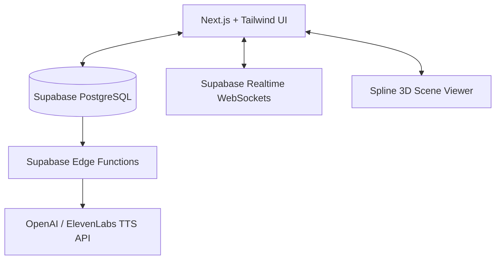

# Technical Stack & Production Pipeline Analysis
## Comparative Public Administration Simulation

This document provides a detailed technical analysis and recommendations for building the **Comparative Public Administration Simulation (Round 1–13)**. It focuses on achieving a **< 24-hour turnaround time** for producing new case studies, managing dynamic visual assets, and evaluating **Gaussian Splatting (3DGS)** and the **WizardGenie Game Engine**.

---

## 1. Executive Summary

To scale the simulation effectively across classrooms (often with heterogeneous network conditions and asynchronous gameplay over a 24-hour window), the architecture must treat the core application as a **data-driven player engine** and the case studies as **modular configurations**.

*   **Production Engine**: Next.js (React) + Supabase (PostgreSQL + Realtime Sync) + Spline (Interactive 3D).
*   **Case Study Format**: Standardized JSON configuration schemas declaring steps, rules, roles, and asset variants.
*   **Aesthetic & Immersion**: Modular GLTF/Spline templates that dynamically swap color skins, emblems, and props programmatically rather than rebuilding environments from scratch.

---

## 2. Core Architectural Challenges

Before selecting technologies, we must address three conflicting requirements:

1.  **Asynchronous Multiplayer (24-Hour Lifecycle)**: Players will log in, make a choice, and log out. Lobbies must persist indefinitely in a database state machine, not in volatile server memory.
2.  **Rapid Production (< 24-Hour Turnaround)**: Content authors (not developers) must be able to write, voice, and spin up a new country's assembly case study in a single day.
3.  **Visual Excellence & Load Times**: The app must look premium (e.g., green-themed NASS chambers, historical maces) but remain extremely lightweight so it loads instantly in low-bandwidth regions.

---

## 3. Technology Stack Evaluation

### A. Next.js + Supabase + Spline (Recommended Production Stack)

This modern web-stack represents the optimal balance of design aesthetics, fast load times, and scalable multiplayer data synchronization.

*   **Next.js (Frontend UI)**: Handles rendering, static optimization, and standard web UI pages (like dashboards, lobbies, and chat).
*   **Supabase (Backend & Realtime)**:
    *   *PostgreSQL*: Stores lobby configurations and user states.
    *   *Realtime Engine*: Syncs actions immediately using WebSockets when users are online simultaneously.
    *   *Edge Functions*: Validates step confirmations (making sure only the designated role-owner can confirm).
*   **Spline (Interactive 3D Engine)**: An easy-to-use collaborative web 3D editor. Spline handles hover states, materials, and lightweight 3D animations natively in the browser via WebGL. The developer simply loads the Spline scene by ID.

---

### B. Gaussian Splatting (3DGS)

Gaussian Splatting (3DGS) renders photorealistic 3D representations of real-world objects or scenes captured via standard video or photos.

#### Strengths
*   **Instant Scene Generation**: You can scan a physical room or a prop (like a replica mace) using a smartphone video, upload it to a processing service (e.g., Luma AI, Postshot), and render it inside the browser within 20 minutes.
*   **Stunning Realism**: Refracted glass, metal textures, wood panel reflections, and detailed geometry are captured perfectly, bypassing hours of manual lighting setup.

#### Weaknesses & Risks
*   **Monolithic Assets (Non-Editable)**: Point clouds are static. You cannot change a seat color from green to red, replace a coat of arms, or slide open a dynamic door. To change the chamber skin, you must capture a completely different physical room.
*   **High Performance/Bandwidth Cost**: Full room splats range from **30MB to over 150MB**. Loading this on mobile networks or school-grade Wi-Fi will result in loading freezes and high dropout rates.
*   **Isolated Lighting**: Virtual avatars placed in a splat scene will look out-of-place because standard 3D meshes do not automatically receive or cast shadows aligned with the baked-in lighting of the splat.

> [!TIP]
> **Recommended Approach for Splats**: Pre-render the Gaussian Splat of the chamber into a highly compressed, high-resolution 2.5D background image (or skybox panorama) under 2MB. This retains photorealism without the heavy load time, allowing lightweight 3D meshes (avatars, mace) to render on top.

---

### C. WizardGenie Game Engine

WizardGenie (Sorceress Game Creation Suite) is an AI-native, prompt-driven game engine designed for rapid "vibe-coding" and prototyping.

#### Strengths
*   **Unrivaled Prototyping Speed**: Excellent for rapidly demonstrating flows, mockup dialog trees, rendering simple voxel assets, and validating step rules in an interactive web preview.
*   **All-in-One Generator**: Generates UI sprites, sound effects, and simple 3D models via chat prompts inside the workspace.

#### Weaknesses & Risks
*   **Multiplayer Limits**: Gated confirmation steps, database persistence, state transitions, and async session management are core relational database operations. Traditional game engines are optimized for physics loops and fast graphics rendering, making custom database-driven multiplayer workflows complex to implement and scale.
*   **Vendor Lock-In**: Developing in a closed AI-native sandbox makes it harder to export cleanly, integrate with school LMS platforms, or run performance-level optimizations.

---

## 4. The < 24-Hour Case Study Production Plan

To guarantee that a new case study (e.g., UK House of Commons or US Senate) can be launched in under 24 hours, the platform uses a **data-driven design pattern**:

### A. The Case Study JSON Configuration Schema
Developers never write code for a new case study. Instead, content designers write a structured JSON file that configures:
1.  **Chamber Themes**: Textures, wall panel types, and emblem image links.
2.  **Role Profiles**: Office names (e.g., *Speaker* vs. *Senate President*), profile avatars, and step confirmation rules.
3.  **Step-by-Step Questions**: Dialogs, mottos, crisis parameters, and choices.
4.  **Math Rules**: Mathematical hooks modifying variables (e.g., `IF choice = A THEN trust += 10, capital -= 5`).

### B. Modular Visual Systems
*   **One Master Chamber**: We build one modular 3D chamber shell in Spline. The code switches carpet colors, chair upholstery, and background emblems based on the loaded JSON config.
*   **Anchor Point Prop Swaps**: The 3D scene has empty placement nodes (e.g., `anchor_mace`, `anchor_table`). The engine spawns the designated prop mesh (e.g., `UK_Mace` vs `NG_Mace`) and snaps it to the coordinate on load.
*   **Avatar Apparel Assembler**: Instead of custom texturing avatars, we use a modular system that mounts clothing layers (Agbada, Wigs, Robes, Suits) onto a base mesh.

### C. Automated AI Text-to-Speech (TTS)
*   When a new case study JSON is uploaded, a Node script runs in the background.
*   It sends dialog texts to the **ElevenLabs** or **OpenAI TTS** API using local accent tags (e.g., Nigerian-accented, British RP) and downloads/caches the MP3s. This takes roughly **10 minutes** instead of days of hiring voice actors.

---

## 5. Timeline Comparison for Case Study Production

Below is a comparison of production speed using different workflows:

| Workflow | 3D Environment Prep | Coding & State | Audio & Voice | Total Time |
| :--- | :--- | :--- | :--- | :--- |
| **Traditional Code & 3D** | 3–5 days (modeling/texturing) | 2–3 days (DB setup/routing) | 2 days (Voice actors) | **7–10 Days** |
| **Gaussian Splat + WizardGenie** | 1–2 hours (scan & process) | 4–6 hours (Vibe-coding UI) | 1 hour (AI voice gen) | **6–9 Hours** *(Prototype)* |
| **JSON Config + Modular Web-Engine** | **0 hours** (config-driven) | **0 hours** (interpreted rules) | 10 mins (Automated API) | **< 2 Hours** *(Production)* |

---

## 6. Final Recommendations

1.  **Prototype in WizardGenie**: Use the WizardGenie sandbox to rapidly prototype the aesthetic, test game logic, and run visual tests.
2.  **Deploy on Next.js + Supabase**: Port the WizardGenie logic and templates into a clean, database-first web application.
3.  **Use a Modular 3D/Spline Engine**: Rely on programmatic visual skinning and the anchor-point system to achieve immediate, zero-code environment creation.
4.  **Avoid Full Gaussian Splats in Production**: Due to their file size and static nature, keep splats restricted to static, compressed 2.5D visual backgrounds rather than live 3D assets.
